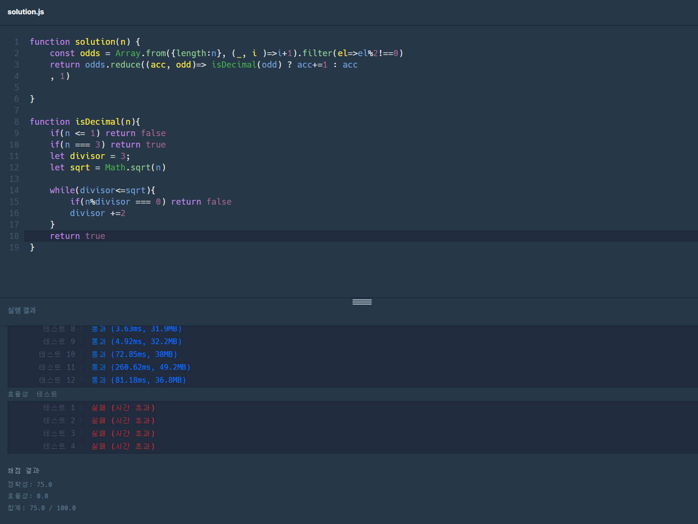

# programmers Lv1

## 소수 찾기

[문제 링크](https://programmers.co.kr/learn/courses/30/lessons/12921)

## 풀이

직접 풀지는 못 했다. 정확성까지는 통과했지만 속도에서 .. 
에라토스테네스의 체라는 것을 활용해야한다.

## 후기

처음에는 짝수를 제외하고 홀수들만 각각 소수인지 판별하는 함수에 넣어서 전부 돌렸더니
속도 효율성 테스트에서 불통되었다.

이후 어떻게 해야할지 몰라서 검색해봤더니 에라토스테네스의 체라는 방식으로 구현해야했다.

그래서 그 방식대로 했는데도 효율성 불통이 나왔다. for문이 아니라 고차함수를 활용해서 그런지? 아니면 이게 구조적으로 효율성이 좀 더 낮아서 불통된거 같기도 하다.

직접 풀진 못 하고 결국 다른 사람의 풀이를 통해 통과해서 .. 좀 찝찝하다.

## 다른 사람의 풀이

set을 이용한 사람이 있엇고, 그 외에는 모두 for문을 사용했다.

배열의 메소드들을 활용해서는 효율성이 통과가 안 되나보다. 

